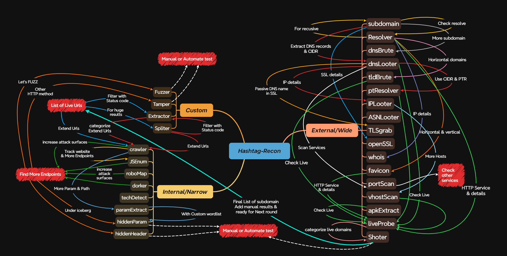

#  &nbsp; 🔭  Hashtag-Recon

<div align="center">

### Reconnaissance & Footprinting framework for BugHunters & RedTeamers  

&nbsp;&nbsp;[](Python)&nbsp;&nbsp;[](Bash)&nbsp;&nbsp;[](LICENSE)


##### This tool able to automate almost all recon steps with External(Wide) and Internal(Narrow) Modules

[Installation](https://github.com/Hashtag-AMIN/hashtag-Recon#Installation) &nbsp; [Workflow](https://github.com/Hashtag-AMIN/hashtag-Recon#workflow) &nbsp; [Usage](https://github.com/Hashtag-AMIN/hashtag-Recon#Usage) &nbsp; [Documentation](https://github.com/Hashtag-AMIN/hashtag-Recon/wiki)

&nbsp; [Modules & Features](https://github.com/Hashtag-AMIN/hashtag-Recon#Modules--Features) &nbsp; [In-Future](https://github.com/Hashtag-AMIN/hashtag-Recon/wiki/05-%E2%80%90-Structure#what-happen-in-future)

</div>

## Installation

### Use these tools in this Framework: 

Need to install Python & Golang

## Common tools

&nbsp; [nmap](https://nmap.org), &nbsp;[jq](https://jqlang.org/), &nbsp;[openssl](https://www.openssl.org/),&nbsp; [curl](https://curl.se/), &nbsp;[wget](https://www.gnu.org/software/wget/), &nbsp;[git](https://git-scm.com/), &nbsp;[whois](https://github.com/rfc1036/whois), &nbsp;[whatweb](https://github.com/urbanadventurer/WhatWeb), &nbsp;[wafw00f](https://github.com/EnableSecurity/wafw00f), &nbsp;[postgresql-client](https://wiki.postgresql.org/wiki/PostgreSQL_Clients), &nbsp;[apktool](https://apktool.org/docs/install)

## External tools:

&nbsp;&nbsp;&nbsp;&nbsp; [Subfinder](https://github.com/projectdiscovery/subfinder), &nbsp; [Sublist3r](https://github.com/aboul3la/Sublist3r), &nbsp; [assetfinder](https://github.com/tomnomnom/assetfinder), &nbsp; [github-subdomains](https://github.com/gwen001/github-subdomains), &nbsp; [dnsx](https://github.com/projectdiscovery/dnsx), &nbsp; [shuffledns](https://github.com/projectdiscovery/shuffledns), &nbsp; [massdns](https://github.com/blechschmidt/massdns), &nbsp; [cut-cdn](https://github.com/ImAyrix/cut-cdn), &nbsp; [ffuf](https://github.com/ffuf/ffuf), &nbsp; [httpx](https://github.com/projectdiscovery/httpx)


## Internal tools:

&nbsp;&nbsp;&nbsp;&nbsp; [gau](https://github.com/lc/gau), &nbsp;[waybackurls](https://github.com/tomnomnom/waybackurls), &nbsp; [getJS](https://github.com/003random/getJS), &nbsp; [katana](https://github.com/projectdiscovery/katana), &nbsp; [unfurl](https://github.com/tomnomnom/unfurl), &nbsp; [fallparams](https://github.com/ImAyrix/fallparams), &nbsp; [RoboFinder](https://github.com/SadraZg/RoboFinder), &nbsp; [trufflehog](https://github.com/trufflesecurity/trufflehog), &nbsp; [wad](https://github.com/CERN-CERT/WAD), &nbsp; [x8](https://github.com/Sh1Yo/x8)


### Also you can install all tools with Tools-Install.sh script

```bash
git clone https://github.com/Hashtag-AMIN/hashtag-Recon.git
cd hashtag-Recon
bash ./modules/Tools-Install.sh
./hashtag-Recon
```

After Need export Golang Path or Copy in $PATH folders:

```bash
export GOPATH=$HOME/go
export PATH="$PATH:$GOPATH/bin"
# Or
cp /root/go/bin/* /usr/local/sbin/ || cp /home/${USER}/go/bin/* /usr/local/sbin/
```

Need Github Subdomain token (optional But use in some module)

```bash
export $GITHUB_TOKEN="Your_Github_Token"
```

### Wordlist

a little but useful Wordlist in ./wordlist collect from [SecList](https://github.com/danielmiessler/SecLists) & [Bugbounty wordlist](https://github.com/Karanxa/Bug-Bounty-Wordlists) & [assetnote](https://wordlists.assetnote.io/)

Also has script that update wordlist with dynamic assetnote wordlist, for some module you have to run and download wordlist at first


```bash
bash ./modules/wordlist-Updater.sh
```

# workflow

able to do all steps in this flow with hashtag-Recon




[More details and autopsy workflow, Checkout Wiki](https://github.com/Hashtag-AMIN/hashtag-Recon/wiki/01-%E2%80%90-Workflow)

Also Xmind file in IMG/ folder with Hashtag-Recon.xmind name

<hr>

# Usage

```php
└─# ./hashtag-Recon


           _     _          _                            ______
          (_)   (_)        | |     _                    (_____ \
          ______ _____  ___| |__ _| |_ _____  ____ _____ _____) )_____  ____ ___  ____
         | ___  (____ |/___|  _ (_   _(____ |/ _  (_____|  __  /| ___ |/ ___/ _ \|  _ \
        | |   | / ___ |___ | | | || |_/ ___ ( (_| |     | |  \ \| ____( (__| |_| | | | |
        |_|   |_\_____(___/|_| |_| \__\_____|\___ |     |_|   |_|_____)\____\___/|_| |_|
                                            (_____|
                                                                Hashtag-Recon
                                                        https://github.com/hashtag-amin

        External:
            subdomain, Resolver, ptResolver, dnsBrute, tldBrute
            dnsLooter, IPLooter, ASNLooter, openSSL, TLSgrab, whois
            favicon, portScan, vhostScan, apkExtract, liveProbe, Shoter

        Internal:
            crawler, JSEnum, roboMap, dorker, techDetect
            paramExtract, hiddenParam, hiddenHeader

        others:
            Fuzzer, Tamper, Extractor, Spliter

```

### Show Help and See all available:

```bash
./hashtag-Recon -h
```

### Run modules or see module help:

```bash
./hashtag-Recon [module_name] [-h|--help]
./hashtag-Recon subdomain -h
./hashtag-Recon Tamper [Flags]
```

Full document of Usage of this tools available

# Modules & Features

## External

### For External recon, available Modules is:

* ## subdomain
    * Find subdomain with Providers, SSL, Reverse Whois, Github, crt.sh, WebHistory & ... in 3 mode:
        * Light: Find subdomain fast, But not completely
        * heavy: Find subdomain completely, But slow
        * recursive: Find 2nd or 3rd level of subdomains

* ## Resolver
    * Resolve Subdomain with dnsx

* ## ptResolver
    * Get PTR record from CIDR/IP

* ## dnsBrute
    * Brute force on subdomains with useful wordlist in two mode:
        * light: Top 500k subdomain,3 Lenght Characters & efficient wordlist for dnsgen
        * heavy: Top 1M subdomain,4 Lenght Characters & complete wordlist for dnsgen
        * full : httparchive_subdomains, best-dns-wordlist.txt, 2m-subdomains.txt, 4 Lenght Characters & complete wordlist for dnsgen

* ## tldBrute
    * Fuzz TLD(Top Level Domain) of domain with dnsx
    
* ## dnsLooter
    * Extract all record of dns, such as: a,aaaa,cname,ns,txt,srv,ptr,mx,soa,axfr,caa

* ## IPLooter
    * Extract details of IP address such as: CIDRs, ASN number, RIR Information & ...

* ## ASNLooter
    * Extract details of ASN number such as: Email Contacts, ASN description, Website & ...

* ## TLSgrap
    * Grab passive unique DNS names from SSL certificates using a list of subdomains, CIDR, IPs.

* ## openSSL
    * More details of SSL/TLS with openSSL command

* ## whois
    * Use Whois command & Extract CIDR, Organization, Email, phone...

* ## favicon
    * Take hash from favicon of websites for search in search engines

* ## portScan
    * with Legend Nmap, scan CIDRs, IPs and domains in 4 mode:
        * http: Scan known ports use http
        * top: Scan top selective ports

* ## vhostScan
    * Fuzzing Host header for find more hosts with 3 patterns:
        * Custom wordlist that include sensetive words use in hosts
        * FUZZ.domain.site with smae wordlist.
        * Subdomains lists

* ## apkExtract
    * Decompile APK file and search for urls with apktool

* ## liveProbe
    * Send HTTP request and find live domains and details in 2 mode:
        * light: Scan top ports use http
        * heavy: Scan known ports use http

* ## Shoter
    * Take screeenshot from urls 
        * at first time httpx install headless browser :)

#### [For Help and Usage of External Modules, Checkout Wiki](https://github.com/Hashtag-AMIN/hashtag-Recon/wiki/02-%E2%80%90-External%E2%80%90Recon)

<hr>

## Internal

### For Internal recon, available Modules is:

* ## crawler
    *  Crawl website & earn more urls in 3 mode:
        * headless: Deep crawl and use headless browser
        * active: Active crawl and extract new path from response and JS files
        * passive: passive crawl without Send HTTP request on target, use gau & waybackurls

* ## JSEnum
    * With JS files, able to process that in 3 mode:
        * content: Extract, Store and make hash from content of JS files for track
        * secret: Find Sensetive data and API key from:
            * directory: Stored request/response of files
            * git: repository url in git
        * endpoint: Extract all Endpoints from raw content of JS files

* ## roboMap
    * find old and robots & sitemap archive.org and Send request to website for find robots & sitemap, then extract all path

* ## dorker
    * Search Query on search engines such as: google, bing, yahoo, ask, duck, shodan

* ## techDetect
    * Detect technology & infrastructure use in DomainName for efficient hunting

* ## paramExtract
    * Extract Parameters & make Custom wordlist for Hidden Parameter discovery, Also extract Path that include urls file

* ## hiddenParam
    * Hidden Parameter Discovery with x8 in tow mode:
        * a wrapper of x8 with default wordlist and add random user-agent and browser headers

* ## hiddenHeader
    * Hidden Header Discovery with x8 in tow mode:
        * a wrapper of x8 with default wordlist contain almost all http headers

#### [For Help and Usage of Internal Modules, Checkout Wiki](https://github.com/Hashtag-AMIN/hashtag-Recon/wiki/03-%E2%80%90-Intrenal%E2%80%90Recon)

<hr>

## Others

### In 'Others' Module, Some process need in both last Modules:

* ## Fuzzer
    * Fuzz url with sensetive dir, file or custom wordlist in 3 mode:
        * directory: Fuzzing in end path of url with sensetive directory wordlist
        * file:  Fuzzing in end path of url with wordlists that include sensetive extention of files
        * Custom: Use Custom wordlist and FUZZ keyword in url for Fuzzing

* ## Tamper
    *  Tamper http method of request with 2 mode:
        * light: Verb Tampering top http method
        * heavy: Verb Tampering known http method

* ## Extractor
    * Extract input file that result of other Modules with these property:
        * liveprobe: Extract liveProbe module result with HTTP Status code (20X, 30X, 4XX, 50X)
        * vhost: Extract vhostScan module result with HTTP Status code and Host header value
        * crawl: Extract crawler module result with extentions(.php, .js, .jsp, .asp, .aspx, html, htm) & urls contains with and without parameter
        * fuzz: Extract fuzzer module result with HTTP Status code
        * ip: Extract IPs from file to input
        * diff: Extract diffrence between two file in -dns but not in -provider file(Check priority)

* ## Spliter
    * Split input file with 3 mode:
        * line: Input split by X lines
        * file: Input split to X files
        * size: Input split to files have X size(20M|100K|2G)

#### [For Help and Usage of Others Modules, Checkout Wiki](https://github.com/Hashtag-AMIN/hashtag-Recon/wiki/04-%E2%80%90-Others)


## Contributing

Contributions are always welcome! I believe that great tools are built by great communities. Whether you’re fixing a bug, suggesting a feature, or simply sharing an idea, your contributions are invaluable. Together, we can make this project even better!

Dive in, share your expertise, and let’s create something amazing. Every pull request, issue, or suggestion helps shape the future of this tool. Let’s collaborate and innovate! 🌟

If you'd like to contribute to this project, [checkout wiki in structure page](https://github.com/Hashtag-AMIN/hashtag-Recon/wiki/05-%E2%80%90-Structure)

<hr style="width: 40%;" >


***Happy Learning :)***

***Happy Hunting*** 🎯
